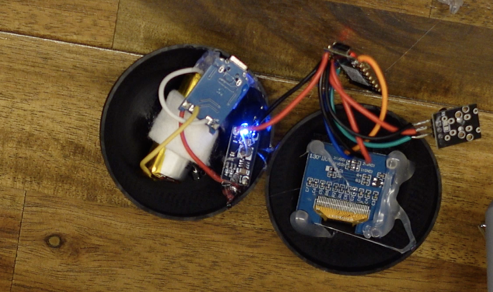

# Chaos 8 Ball 🔮💀  
A cursed Magic 8 Ball that doesn't give answers — it gives *warnings*. 
Built using an ESP32, vape batteries, and too much hot glue.

---

## 🎬 As Seen In

This project appeared in my YouTube video:  

This project appeared in this [instructable](https://www.instructables.com/ESP32-Chaos-Orb/).

---

## ⚠️ What Is This?

This is a DIY project for building your own **Chaos 8 Ball** — a chaotic prophecy orb that responds to shakes with awful advice like:

- "Run."
- "File your taxes in crayon."
- "Ask your ex for closure."
- "The end is nigh."

This is not a tutorial, more of a vibes-based guide for a ball made for laughs.

---

## 🧠 Features

- Shake-to-activate OLED display
- Random cursed responses (currently hardcoded in the sketch)
- Rechargeable with USB-C
- Designed to confuse guests and disappoint family

---

## 🧰 Parts List

| Part | Notes |
|------|-------|
| ESP32-C3 Mini | Small, cheap, and just enough GPIO for chaos |
| OLED Display (SH1106) | 128x64, I2C |
| Shock Sensor | Detects a shake to trigger prophecy |
| TP4056 Charging Module | For charging the vape cell |
| 3.7V Vape Battery | Please don’t steal these from the bin like I did |
| Boost Converter | To bump battery voltage to 5V if needed |
| Power Switch | Technically I didn't include one.... maybe you should |
| 3D Printed Shell | Modeled in FreeCAD (STLs included) |

---

## 🔧 Setup Instructions

1. Flash the ESP32-C3 using Arduino IDE or PlatformIO.
2. Wire up OLED display to I2C pins (SDA/SCL).
3. Attach the shock sensor to a digital input pin (configured in code).
4. Connect power via battery + TP4056.
5. Print the shell, glue things irresponsibly.
6. Shake it.

---
## 🗺️ Layout Diagram

This diagram shows the rough wiring layout — it’s cleaner than my actual build.

## ⚠️ Real-World Wiring

Here’s the actual wiring secured by glue, which is, let’s be honest, a war crime. It works though.

--

## 📦 Dependencies

Install these libraries in Arduino IDE:

- U8g2lib.h
- esp_sleep.h
- Wire.h (included by default)
- driver/gpio.h

---

## 🧪 Testing

Shake it. It should display a random line from the list. If not:
- Make sure the OLED is wired properly.
- Confirm your shock sensor triggers HIGH/LOW correctly.
- Recheck your I2C address if using a different display.
- Edit configuration headers (U8g2lib.h or U8x8lib.h) to match your specific display.

---

## 💡 Improvement Ideas

Here’s some cursed potential for v2 if you are up to the task:

- **OTA updates** (so you can remotely change the prophecies, currently it is sealed shut)
- **Sound module** to make it growl or whisper weird stuff
- **Vibration module** to give it a low rumble when generating prophecies
- **RGB LED glow** for a dramatic effect

---

## 📮 Contribute Your Own Chaos

Have better cursed advice? Edit the hardcoded list in the sketch file!  
If you build one, I would love to see it!
Here are some amazing ones that have been created - I hope they give you inspiration!
[Shizzind - Github](https://github.com/Shizzind)

[vandoore - Instructables](https://www.instructables.com/member/vandoore/) [lektron1 - Instructables](https://www.instructables.com/member/lektron1/)
 

---

## 🖤 License

Just attribute me and do whatever. Just don’t blame me when it combusts.
